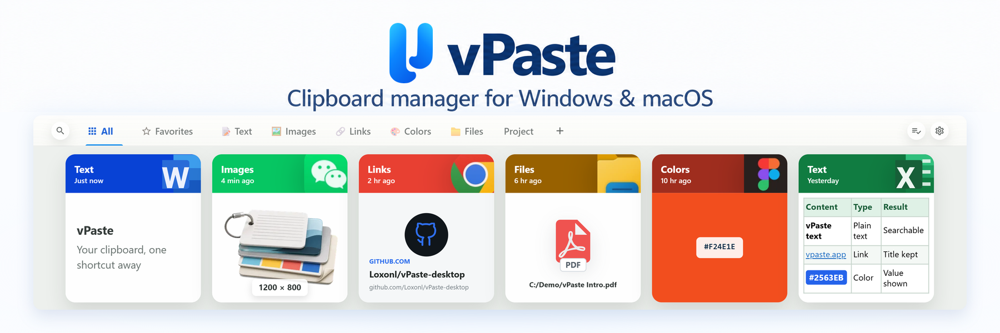

<div align="center">



<h3>English · <a href="README.zh-CN.md">简体中文</a></h3>

# vPaste: Your clipboard, one shortcut away

A visual clipboard manager for Windows and macOS. Keep text, images, links, colors, and files in searchable cards, ready to preview and paste. Your history stays on your device.

<p>
  <a href="#download"></a>
  <a href="#download"></a>
  <a href="https://github.com/Loxonl/vPaste-desktop/releases"></a>
  <a href="https://v2.tauri.app/"></a>
  <a href="LICENSE"></a>
</p>

<h3><a href="https://vpaste.app/en/">vpaste.app</a></h3>

[Download](#download) · [Features](#features) · [Changelog](CHANGELOG.md) · [Contributing](#contributing)

</div>

<div align="center">


https://github.com/user-attachments/assets/900054a3-de8b-48e8-92f4-60d6ba3196e8


</div>
<p align="center"><strong>vPaste feature demo</strong></p>

## Features

### Supported content types

vPaste automatically records supported clipboard content and displays it as cards, with the copy time and source app.

| Type | Display and preview | Available actions |
| --- | --- | --- |
| Text | Plain and rich text, including headings, lists, tables, and links | Search the content; paste with formatting or as plain text |
| Images | Card thumbnails, full-size previews, dimensions, and GIF identification | Paste or drag into compatible apps; export as an image file |
| Links | URL, plus the page title and image when link previews are enabled | Search by title or URL; preview the page or open it in a browser |
| Colors | Color swatch and value | Convert between HEX, RGB, and HSL; copy the value you need |
| Files | Single files, folders, and multi-file records; previews for supported formats | Paste or drag files; open their location or copy their paths |

Rich-text fidelity, file previews, and drag-and-drop support depend on the source format and receiving app. File records reference the original files on disk; they are not permanent backups.

### Search and organization

- **Keyword search:** find text, webpage titles, URLs, file names, paths, or source apps.
- **Filters:** narrow results by content type, source app, or date, and find items in your favorites and tags.
- **Organization:** favorite frequently used records, add tags, and group content in custom tabs.

### Preview and paste

Launch vPaste and complete the first-run guide, then copy as usual. Press `Alt + V` on Windows or `Option + V` on macOS to open your history, select a card, and press `Enter` to paste into the current app. On macOS, the guide explains how to grant Accessibility permission for automatic pasting.

- **Content preview:** press `Space` to inspect full text, images, webpages, and supported file content before pasting.
- **Paste format:** keep supported rich-text formatting, or use `Shift + Enter` to paste as plain text.
- **Paste queue:** turn on the queue, copy several items in sequence, then use `Ctrl + V` or `⌘ + V` to paste them in order, for example into separate form fields.
- **Drag and drop:** drag text, links, images, or files into compatible apps; multi-file records can be dragged together.
- **Multiple displays:** the panel follows the screen you are working on.

### Keyboard shortcuts

Default controls:

| Action | Windows | macOS |
| --- | --- | --- |
| Show / hide the panel | `Alt + V` | `Option + V` |
| Toggle the paste queue | `Alt + Shift + V` | `Option + Shift + V` |
| Search in the panel | `Ctrl + F` | `⌘ + F` |
| Select the previous / next card | `←` / `→` | `←` / `→` |
| Preview the selected card | `Space` | `Space` |
| Paste the selected card | `Enter` | `Enter` |
| Paste as plain text | `Shift + Enter` | `Shift + Enter` |

Panel, queue, and plain-text paste shortcuts can be changed in Settings.

### Interface settings

- **Appearance and language:** follow the system theme or choose light or dark mode; switch between English and Simplified Chinese.
- **Startup and background behavior:** configure startup, tray, and background options in Settings.
- **Panel state:** optionally remember your search, selected tab, and scroll position when reopening the panel.

### Local storage and privacy

Clipboard history is stored locally. vPaste does not upload it to a cloud service, and using the app does not require an account.

- **Recording controls:** exclude selected source apps or pause recording. Sensitive-content protection skips system-marked sensitive content where supported; it does not detect every password or secret automatically.
- **Storage and cleanup:** choose the history storage folder, review storage usage, and clear older records by age.
- **History transfer:** manually export/import a history archive between Windows and macOS installations. Automatic cloud sync is not included. Archives contain clipboard content, so keep them private.
- **Network access:** link auto preview is enabled by default and requests the linked webpage for its title and image; you can disable it in Settings. Opening a webpage preview also contacts that site. Update checks and downloads contact the release service.

## Download

| Platform | System | Download |
| --- | --- | --- |
| Windows · x64 | Windows 10 22H2 / Windows 11 | [Installer `.exe` / Portable `.zip`](https://github.com/Loxonl/vPaste-desktop/releases) |
| macOS · Apple silicon | macOS 11 or later | [Apple silicon `.dmg`](https://github.com/Loxonl/vPaste-desktop/releases) |
| macOS · Intel | macOS 11 or later | [Intel `.dmg`](https://github.com/Loxonl/vPaste-desktop/releases) |

## FAQ

<details>
<summary><strong>Why does pasting need permission on macOS?</strong></summary>

vPaste uses Accessibility permission to send the paste action to your current app. Enable vPaste in **System Settings → Privacy & Security → Accessibility**, then retry. If automatic pasting fails, follow the in-app notice and paste manually with `⌘ + V`.

</details>

<details>
<summary><strong>Does copying a file keep a permanent backup of it?</strong></summary>

File records refer to files on disk. Moving or deleting the originals can make them unavailable for preview, paste, or drag and drop. Exporting clipboard history does not replace a backup of the original files.

</details>

<details>
<summary><strong>Can I use vPaste on Linux?</strong></summary>

The supported desktop platforms are currently Windows and macOS. There is no official Linux package.

</details>

## Development

vPaste uses **Tauri 2 + Rust** for the desktop app and **React 18 + TypeScript + MUI 5 + Motion** for the interface.

To build from source, install Node.js (see [`.node-version`](.node-version)), npm 11, Rust (see `rust-version` in [`Cargo.toml`](src-tauri/Cargo.toml)), and the [Tauri platform prerequisites](https://v2.tauri.app/start/prerequisites/).

```sh
git clone https://github.com/Loxonl/vPaste-desktop.git
cd vPaste-desktop
npm ci
npm run dev:debug
```

`dev:debug` runs the desktop app on Windows or macOS with development-only tutorial and test tools. On macOS, quit an existing vPaste instance first. `npm run dev` runs only the frontend and does not provide native clipboard integration.

See [CONTRIBUTING.md](CONTRIBUTING.md) for checks, the [architecture guide](docs/open-source/architecture.md) for a source overview, and the [documentation index](docs/README.md) for platform and packaging details.

## Contributing

Bug reports, focused fixes, documentation improvements, and translations are welcome.

- **Report a bug or suggest a feature:** open an [issue](https://github.com/Loxonl/vPaste-desktop/issues). Include your app version, OS, and steps to reproduce; use sample clipboard content.
- **Submit a change:** read [CONTRIBUTING.md](CONTRIBUTING.md) and the [Code of Conduct](CODE_OF_CONDUCT.md).
- **Help with translations:** see the [language pack guide](docs/open-source/language-packs.md).
- **Report a security issue:** follow [SECURITY.md](SECURITY.md). Keep sensitive details out of public issues.

## License

vPaste is licensed under **[GPL-3.0-only](LICENSE)**. Contributions are made under the same license. See [third-party notices](docs/open-source/third-party-notices.md) for dependency licenses and acknowledgments.
