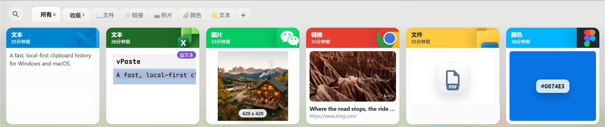
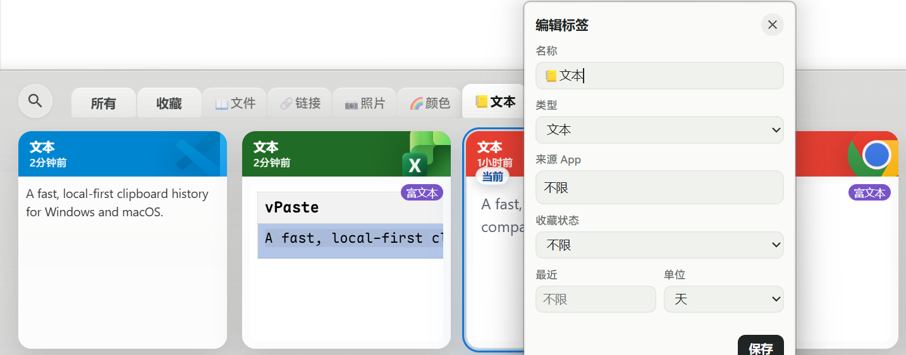
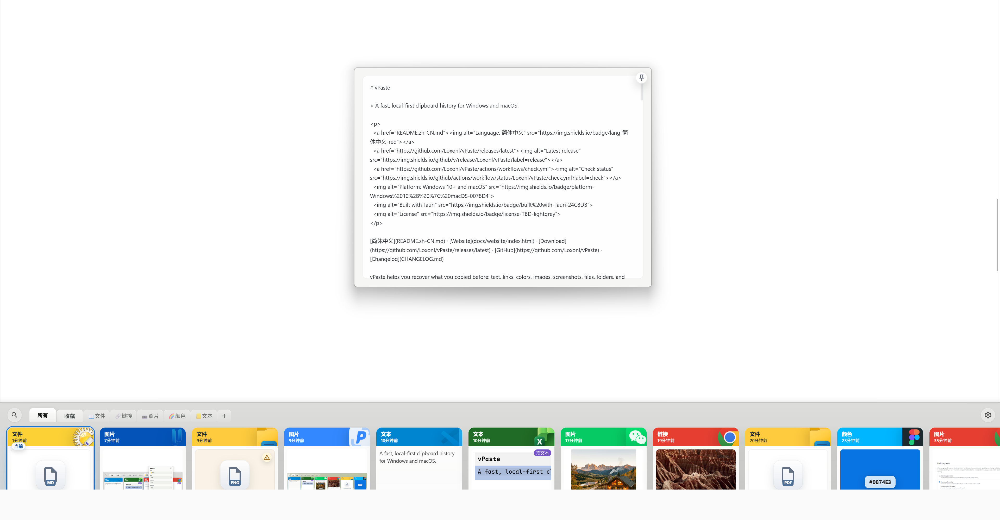
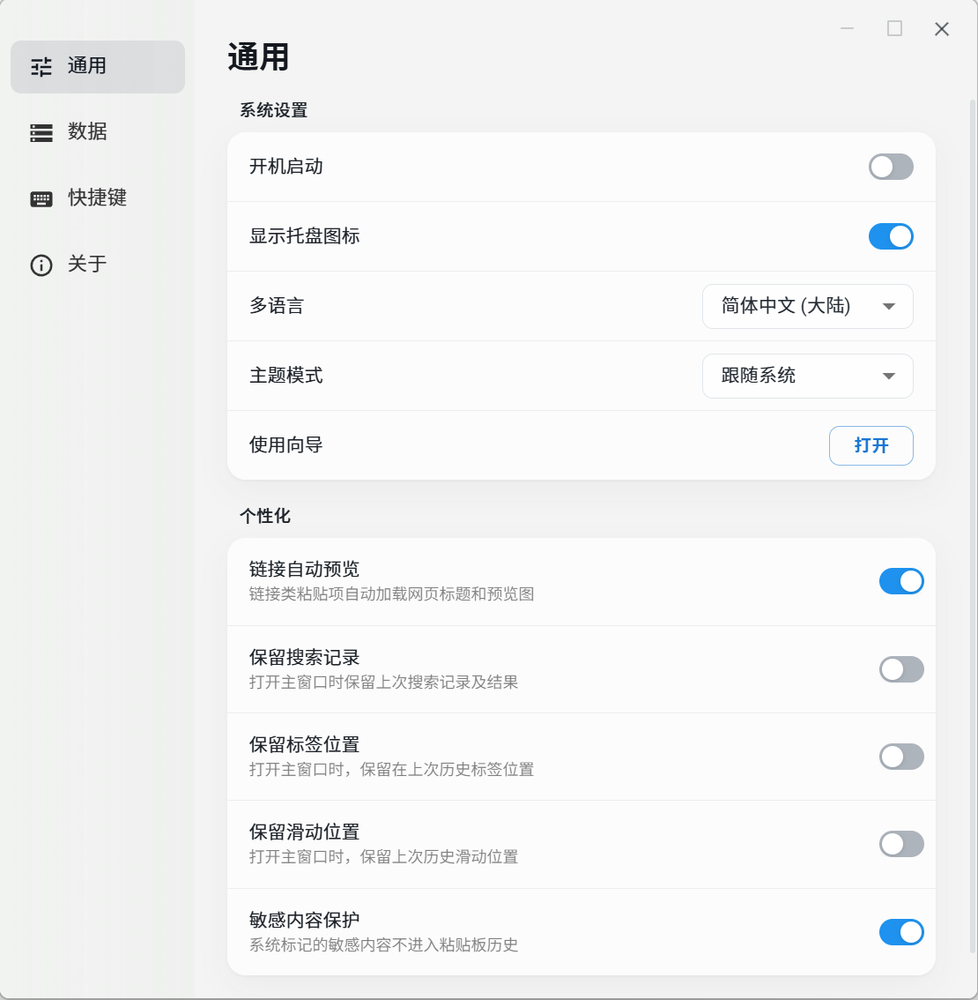

# vPaste Desktop

vPaste 是一个本地优先的 Windows / macOS 桌面剪贴板管理器。它在你的设备上保存剪贴板历史，支持快速搜索和预览，并尽量保留有用的剪贴板上下文，而不把剪贴板数据发送到云端服务。

本仓库包含桌面应用的 GPL-3.0-only 公开源码和可复现发布定义。

## 功能

- 本地优先的剪贴板历史。
- 支持文本、图片、文件、链接、颜色和富文本等剪贴板项目。
- 面向搜索的剪贴板存储。
- 托盘 / 菜单控制和全局快捷键支持。
- 基于 Tauri 的 Windows / macOS 桌面外壳。
- 英文和简体中文界面文本。

## 界面截图









## 隐私

vPaste 设计为本地运行。剪贴板数据保存在用户设备上。在平台支持的情况下，系统标记的敏感剪贴板内容默认会被忽略。

请不要在公开 issue 中粘贴密钥、密码、令牌、私人消息或敏感剪贴板内容。安全问题报告方式见 [SECURITY.md](SECURITY.md)。

## 环境要求

- Node.js 24.11.1 与 npm 11。
- Rust 1.91.1。
- Tauri 2 在 Windows 或 macOS 上开发所需的平台依赖。

## 开发

安装依赖：

```powershell
npm ci
```

仅运行前端开发服务器：

```powershell
npm run dev
```

运行桌面应用开发模式：

```powershell
npm run dev:app
```

构建前端：

```powershell
npm run build
```

检查 Rust / Tauri 侧：

```powershell
cargo check --manifest-path src-tauri\Cargo.toml
```

检查 Rust 格式：

```powershell
Push-Location src-tauri
cargo fmt --all --check
Pop-Location
```

构建不带 Updater 签名的本地安装包：

```powershell
# Windows x64 NSIS
npm run build:windows

# macOS DMG（需在 macOS 上执行）
npm run build:macos
```

本地包仅用于开发测试，不属于官方签名发布包。

## 发布

推送 `v1.5.0` 这样的版本 tag 后，公开 Release 工作流会创建一个 GitHub Release 草稿，其中包含：

- Windows x64 NSIS 安装包。
- Apple silicon 与 Intel 两种 macOS DMG 和更新包。
- Tauri Updater 签名与 `latest.json`。
- SHA-256 校验和、CycloneDX SBOM、依赖许可证清单和构建来源证明。
- GitHub 自动生成的源码归档及 GPL 许可证。

正式包必须通过 Windows Authenticode 签名，以及 Apple Developer ID 签名和公证；维护者完成安装/更新冒烟测试后再手动发布草稿。详见[发布检查清单](docs/open-source/releases/release-checklist.md)。

## 贡献

请阅读 [CONTRIBUTING.md](CONTRIBUTING.md) 和 [CODE_OF_CONDUCT.md](CODE_OF_CONDUCT.md)。提交 Pull Request 即表示贡献者确认自己有权提交这些改动，并同意这些贡献作为本项目的一部分按 GPL-3.0-only 授权。

## 许可证

vPaste Desktop 使用 GPL-3.0-only 许可证。见 [LICENSE](LICENSE)。

第三方依赖声明和署名说明见 [docs/open-source/third-party-notices.md](docs/open-source/third-party-notices.md)。
